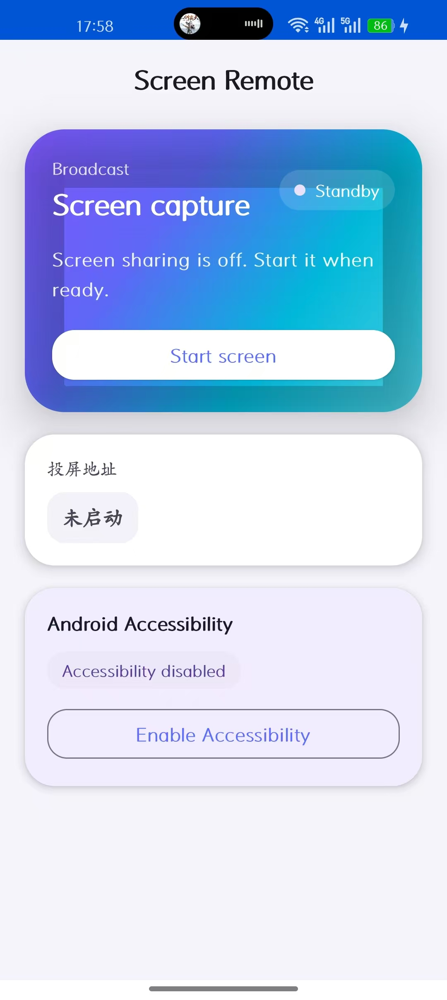
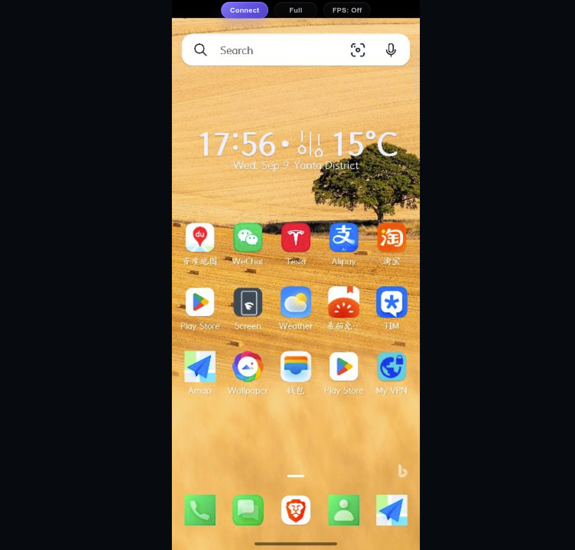

# Screen

这是一个用google gemini 产生的特斯拉投屏程序，可以工作在android 14 以上的设备。本程序利用了Websocket 和JPEG 图片的方式完成。没有使用webrtc和MJPEG.  

 **使用方法**
 - 1. 打开手机热点
 - 2. 用特斯拉连接手机热点，并且勾那个在行驶中不断网的选择框
 - 3. 启动这个APP, 然后在特斯拉浏览器上访问这个地址http://9.9.9.9:8080 

 - 4. 就可以在特斯拉屏幕上点击connect 按钮，就能看到如下图：

本程序在特斯拉model y 2023-2025 上都测试过，可以正常工作。
 
 
